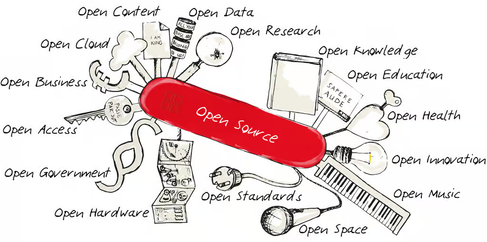

<h1 align="center">
 Hi there, I'm Jawher
</h1>

  

Welcome to my GitHub profile! I'm a passionate Full-Stack Engineer and open-source contributor with over 2 years of hands-on experience, specializing in widely acclaimed technologies such as Angular, Spring Boot, Quarkus, Android, Node.js, Symfony, Go and DevOps. My journey in the world of programming has been driven by a deep curiosity and a desire to create efficient, scalable, and user-friendly applications.

<h2>🌟 About Me</h2>

 
  - 💻 I specialize in JS, PHP and Java, but I enjoy exploring other technologies and languages as well.
  - 🚀 I'm always eager to learn new things and take on new challenges.
  - 🎓 I believe in the power of knowledge-sharing and open source.

<h2>🛠️ Skills and expertise</h2>

  - **Frontend:** Angular, HTML, SCSS, CSS, Bootstrap, React, Android Studio, Flutter.
  - **Backend:** Node.js, Go, Symfony, Spring Boot, Quarkus.
  - **Programming Languages:** Java, PHP, JavaScript, TypeScript, Python, Go, C++.
  - **Databases:** MySQL, PostgreSQL, MongoDB, Firebase, SQLite.
  - **Tools:** Git, Docker, K8s, Jenkins, Lens, Kafka, Argocd, Redis, Portainer, ELK Stack, Grafana, Graylog, Prometheus, Hadoop.
  - **Languages:** English, French, Arabic.

  
💡 I thrive on challenges and enjoy learning new technologies to solve complex problems. I'm always eager to collaborate on exciting projects and contribute to the tech community.
 

 

<h2>🔭 My github stats</h2>

  

   &nbsp;&nbsp;&nbsp;
   
     
   
     
   
    
   
   
   
📫 Let's connect and build something amazing together!

  

 

***

  <i>&copy; <a href="https://github.com/JawherKl/">JawherKl </a> 2024 - Present</i> 
  <i>Licensed under <a href="https://github.com/JawherKl/JawherKl/tree/master/LICENSE">GNU Affero General Public License</a></i> 
   
  <kbd>Thanks for visiting 🙂</kbd>

<!---->
<!--
learning to debug and reverse engineering.
dark, radical, merko, gruvbox, tokyonight, onedark, cobalt, synthwave, highcontrast, dracula
https://my-stats-43gk.vercel.app/api?username=JawherKl&show_icons=true&theme=radical&hide=contribs,issues&show=discussions_answered&rank_icon=github&include_all_commits=true&card_width=150
https://my-stats-43gk.vercel.app/api/top-langs/?username=JawherKl&hide=html,scss,css&langs_count=8&layout=compact&theme=radical&card_width=150
https://github-readme-streak-stats-git-main-davids-projects-ad77adcc.vercel.app/?user=JawherKl&theme=radical
-->