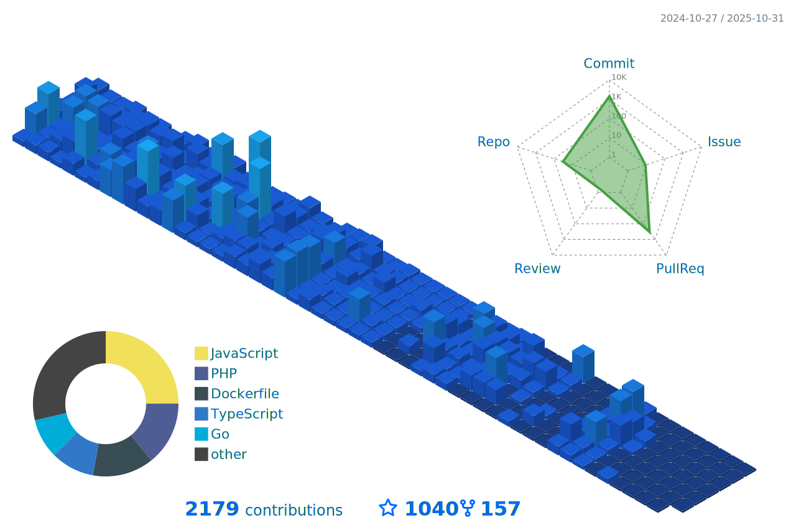

<h1 align="center">
  
</h1>

      

<table>
  <tr>
    <td align="center">
      <a href="README_fr.md">🇫🇷 Switch to French</a>
    </td>
    <td align="center">
      <a href="README_de.md">🇩🇪 Switch to German</a>
    </td>
    <td align="center">
      <a href="README_it.md">🇮🇹 Switch to Italian</a>
    </td>
  </tr>
</table>

Welcome to my GitHub profile! I'm a passionate Full-Stack Engineer and open-source contributor with over 2 years of experience, specialising in widely acclaimed technologies such as Angular, Spring Boot, Quarkus, Android, Node.js, Symfony, Go and DevOps. My journey in the world of programming has been driven by a deep curiosity and a desire to create efficient, scalable, and user-friendly applications.

<h2>🌟 About Me</h2>

 
  - 💻 I specialise in JS, PHP and Java, but I also enjoy exploring other technologies and languages.
  - 🚀 I'm always eager to learn new things and take on new challenges.
  - 🎓 I believe in the power of knowledge-sharing and open source.

<h2>🛠️ Skills and expertise</h2>

  - **Backend:** Node.js, Express.js, NestJS, Go, Symfony.
  - **Frontend:** Angular, HTML, SCSS, CSS, Bootstrap.
  - **Programming Languages:** JavaScript, TypeScript, PHP, Python, Go, C++.
  - **Databases:** PostgreSQL, MySQL, MongoDB, Firebase, SQLite.
  - **Tools:** Git, Docker, K8S, Jenkins, Lens, Kafka, Redis, Argocd, Portainer, ELK-Stack, Grafana, Graylog, Prometheus.
  - **Languages:** English, French, German, Italian and Arabic.

  
💡 I thrive on challenges and enjoy learning new technologies to solve complex problems. I'm always eager to collaborate on exciting projects and contribute to the tech community.
 

 

<h2>🔭 My github stats</h2>

  

   &nbsp;&nbsp;&nbsp;
   
     
   
     
   
     
   
     
   
   
   
📫 Let's connect and build something amazing together!

  

 

 
<h2>🚀 Technologies & Projects</h2>

 I specialise in building scalable applications, backend services, and DevOps solutions using various modern technologies.
 
 #### **💻 Backend Development (60%):**  
 - **Node.js (Express.js and NestJS)** – Crafting efficient and scalable RESTful & GraphQL APIs.
 - **Go** – Building high-performance backend services.  
 - **Symfony** – Developing robust web applications using PHP.
 
 #### **☁️ DevOps & Cloud (20%):**
 - **Kubernetes, Docker, ArgoCD, Jenkins** – Managing CI/CD pipelines and containerized applications.  
 - **Kafka, Redis, ELK-Stack, Prometheus, Grafana** – Ensuring observability and high availability.  
 
 #### **🤖 AI & Large Language Models (LLM) (15%):**
 - Experimenting with **LLMs** for AI-driven applications.  
 - Implementing **ML and AI-based solutions** using Python and cloud services.
 
 #### **🎨 Frontend Development (5%):**
 - **Angular** – Creating dynamic and interactive web applications.    
 
 💡 **Explore my repositories** to see projects leveraging these technologies!  

***

  <i>&copy; <a href="https://github.com/JawherKl/">JawherKl </a> 2024 - Present</i> 
  <i>Licensed under <a href="https://github.com/JawherKl/JawherKl/tree/master/LICENSE">GNU Affero General Public License</a></i> 
   
  <kbd>Thanks for visiting 🙂</kbd>

<!--
learning to debug and reverse engineer.
dark, radical, merko, gruvbox, tokyonight, onedark, cobalt, synthwave, highcontrast, dracula

      
      
      
        
-->
