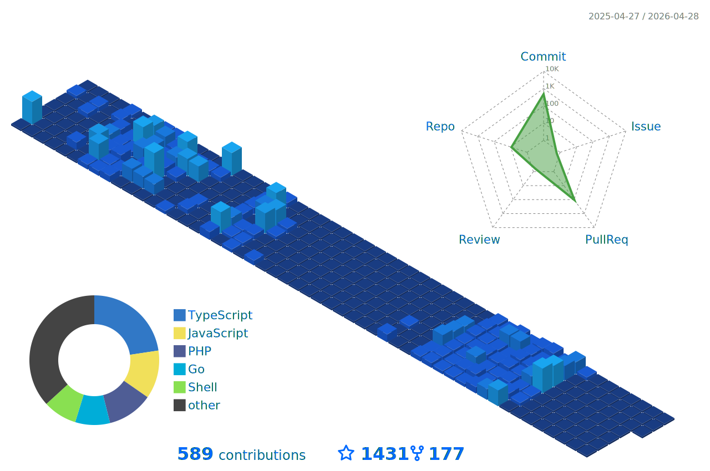

<h1 align="center">
  
</h1>

 
 

<table>
    <tr>
    <td align="center">
      <a href="README.md">🇬🇧 Zu Englisch wechseln</a>
    </td>
    <td align="center">
      <a href="README_fr.md">🇫🇷 Zu Französisch wechseln</a>
    </td> 
    <td align="center">
      <a href="README_it.md">🇮🇹 Zu Italienisch wechseln</a>
    </td>
  </tr>
</table>

**Willkommen auf meinem GitHub profil!**  

Ich bin ein **Full-Stack-Entwickler** und arbeite gerne mit **Open-Source-Projekten**. Ich habe **2 Jahre Erfahrung** mit Angular, Symfony, Spring Boot, Quarkus, Node.js, Go und DevOps. 

Ich liebe Programmieren, weil ich **nützliche Apps** bauen möchte. Meine Apps sollen **schnell** und **einfach** sein.

 
  
<h2>🌟 Über mich</h2>
 

  - 💻 Ich spezialisiere mich auf JS, PHP und Java, aber ich erkunde auch gerne andere Technologien und Sprachen. 
  - 🚀 Ich bin immer begierig darauf, neue Dinge zu lernen und neue Herausforderungen anzunehmen. 
  - 🎓 Ich glaube an die Kraft des Wissensaustauschs und von Open Source. 

 
  
<h2>🛠️ Fähigkeiten und Fachkenntnisse</h2>

  - **Backend:** Node.js, Express.js, NestJS, Go, Symfony. 
  - **Frontend:** Angular, HTML, SCSS, CSS, Bootstrap. 
  - **Programmiersprachen:** JavaScript, TypeScript, Php, Python, Go, C++. 
  - **Datenbanken:** PostgreSQL, MySQL, MongoDB, Firebase, SQLite. 
  - **Werkzeuge:** Git, Docker, K8s, Jenkins, Lens, Kafka, Redis, Argocd, Portainer, ELK-Stack, Grafana, Graylog, Prometheus. 
  - **Sprachen:** Englisch, Französisch, Deutsch, Italienisch und Arabisch.

   
     
  💡 Ich gedeihe bei Herausforderungen und lerne gerne neue Technologien, um komplexe Probleme zu lösen. Ich gedeihe bei Herausforderungen und lerne gerne neue Technologien, um komplexe Probleme zu lösen. Ich bin immer bestrebt, an spannenden Projekten mitzuarbeiten und zur Tech-Community beizutragen.

 

  
<h2>🔭 Meine GitHub-Statistiken</h2>

  

    &nbsp;&nbsp;&nbsp;
    
      
    
      
    
      
    
      
    
    
      
📫 Lass uns verbinden und gemeinsam etwas Großartiges aufbauen! 
  
 

 
  
<h2>🚀 Technologien & Projekte</h2>
 
    Ich spezialisiere mich auf den Bau skalierbarer Anwendungen, Backend-Dienste und DevOps-Lösungen unter Verwendung einer Vielzahl moderner Technologien. 
    
  #### **💻 Backend-Entwicklung (70%):** 
  - **Node.js (Express.js und NestJS)** – Erstellung effizienter und skalierbarer (RESTfull, GraphQL, grpc und soap) APIs.
  - **Go** – Hochleistungsfähige Backend-Dienste erstellen.
  - **Symfony** – Entwicklung robuster Webanwendungen mit PHP. 
    
  #### **☁️ DevOps & Cloud (15%):** 
  - **Kubernetes, Docker, ArgoCD, Jenkins** – Verwaltung von CI/CD-Pipelines und containerisierten Anwendungen.
  - **Kafka, Redis, ELK-Stack, Prometheus, Grafana** – Gewährleistung von Beobachtbarkeit und hoher Verfügbarkeit. 
    
  #### **🤖 AI & große Sprachmodelle (LLM) (10%):** 
  - Experimentieren mit **LLMs** für KI-gesteuerte Anwendungen.
  - Implementierung von **ML und KI-basierten Lösungen** mit Python und Cloud-Diensten. 

  #### **🎨 Frontend-Entwicklung (5%):** 
  - **Angular** – Erstellen dynamischer und interaktiver Webanwendungen. 
    
  💡 **Durchstöbere meine Repositories**, um Projekte zu sehen, die diese Technologien nutzen!

***

 
  <i>&copy; <a href="https://github.com/JawherKl/"> JawherKl </a> 2024 - Gegenwart</i> 
  <i> Lizenziert unter <a href="https://github.com/JawherKl/JawherKl/tree/master/LICENSE"> GNU General Public License</a></i> 
    
    <kbd>Danke für deinen Besuch 🙂</kbd>

